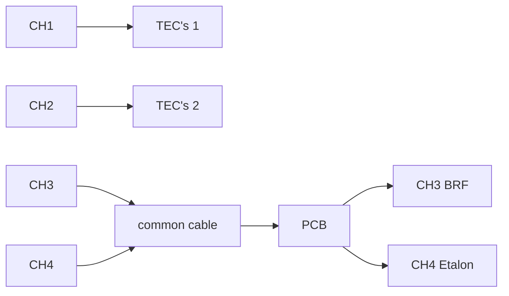

## Arroyo setup
This document describes the process of setting up the Arroyo temperature controller for VECSEL neXt.

### Why change the current system?
The current system for cooling neXt relies on a Raspberry Pi with a custom hat designed by Tobi to control the TEC's.\
There are 4 TEC's in total, controlling the case-temperature of the VECSEL, which is directly connected to the gain chip (GC). 
The pump laser (pump) can output a maximum of 40 W, which heat up the GC and beam-dumb (BD) significantly.

If we assume that all of the pump power is converted to heat, then there is a maximum of 40 W of heat that needs to be removed.\
At the moment there are 2 TEC's in series, with 2 systems in parallel, controlled by a 20 W Thorlabs (MTD1020T) controller.
If we take into account, that the TEC's are only 30-70% efficient in cooling mode, then we can expect to have a maximum of 12-28 W of cooling power.
This means, that the current system might not be sufficient for higher pump powers.

For this reason we chose to switch to the Arroyo controller (7154-05-12), which can provide 60 W per channel, with 4 channels in total.\
This means that at a maximum of 120 W powering the TEC's on the case, we can expect to have a maximum of 36-84 W of cooling power.
Which should be sufficient for our needs and offer enough headroom for temperature changes in the Lab.

### Setting up the Arroyo controller

#### 1. Connecting the Arroyo to the network
The Arroyo controller can be connected to the network via Ethernet.\
I registered it with the IT department and assigned it a static IP address (10.5.78.189).

Note to self: *Don't change the settings of the Arroyo on the [network interface](https://10.5.78.145:2222) and run the whole script. This caused problems for other VECSEL's ([Mattermost link](https://qsim-mattermost.uni-freiburg.de/oneworld/pl/pp1tsbjwztrwzezhfxogc9dsfw)).*

#### 2. Building cabels for interfacing with the VECSEL and TEC's directly
The Arroyo controller has 4 channels, each with a DB15 connector (15 pin).\
I decided on the following cable setup:

With the following pinout for the DB15 connectors:

There is a pass-through PCB that allows us to interface with TEC 3/4 without opening the VECSEL.\
The connector on the PCB is a 24 pin Molex connector, but only pins 8-15 are used for the TEC's.\
I have to double-check with Tobi what pins 6 / 7 are used for.

