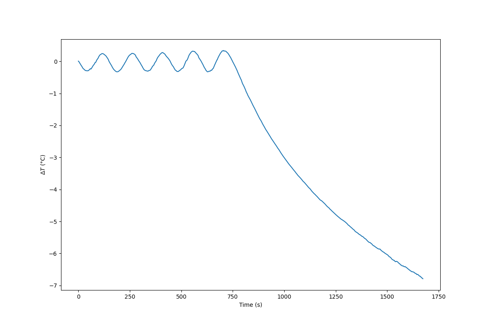

## PID tuning of the Arroyo
In this document, I will discuss the process of PID tuning of the Arroyo and problems I encountered.

### Gain
Before being able to tune the PID values, each channel's gain must be set to PID.\
As standard they are set to 10, this setting prevents the PID values from being read or written.

```IEEE-488.2
TEC:GAIN PID
```
### Auto-tuning
The Arroyo supports an auto-tuning function, which runs an algorithm to find fitting PID values for the selected channel.\
The algorythm used by the Arroyo is a Ziegler-Nichols method, which is a well known method for PID tuning.

This method works by ramping the P-value until the system starts to oscillate.\
The P-value at which the system starts to oscillate is called the ultimate gain (Ku) and used to estimate the PID values.

I only encountered problems with the auto-tuning function, as when ever I tried to run it, the controller would max out the TEC's and not recover.\
It would plummet the temperature, but I never saw it try to recover.



*This was performed at 25°C setpoint => $\Delta T = -7°C$ equals to $T = 18°C$*

On the day of performing this test, the lab temperature was 24°C, whilst there were problems with the dehumidifier, which caused the relative humidity to reach above 50%.\
For this reason, I never wanted to reach temperatures below 15°C, as the risk of condensation was too high.

After this occurring for every try, I started to tune manually, which is a much slower process, but I can control it.

### Manual tuning
