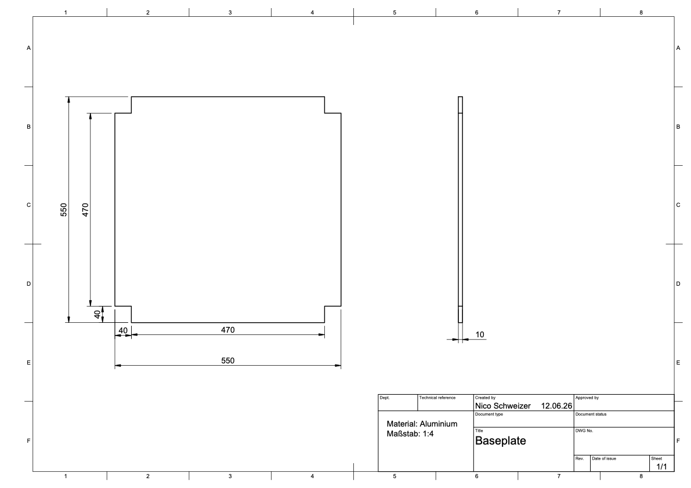
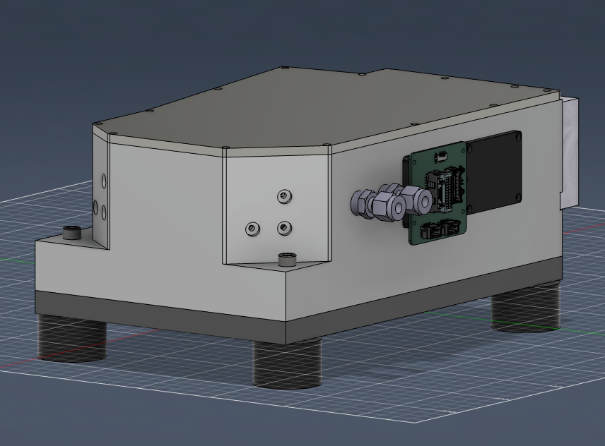
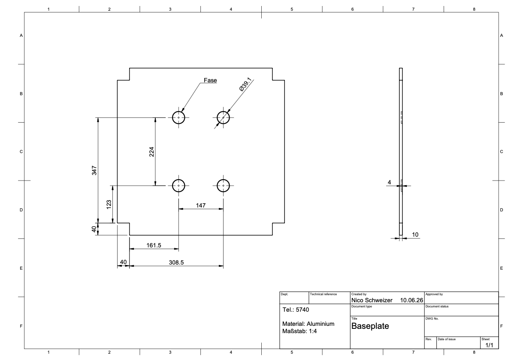
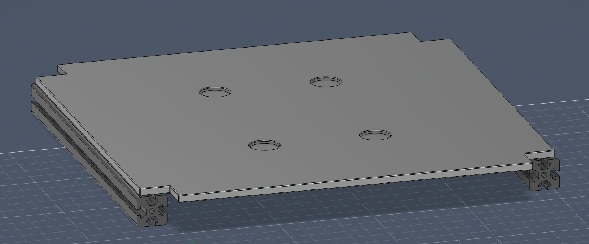
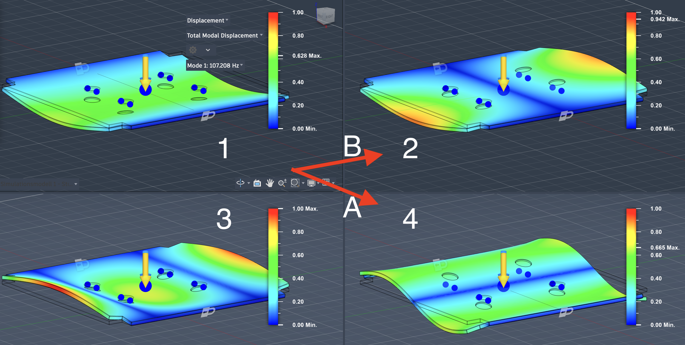
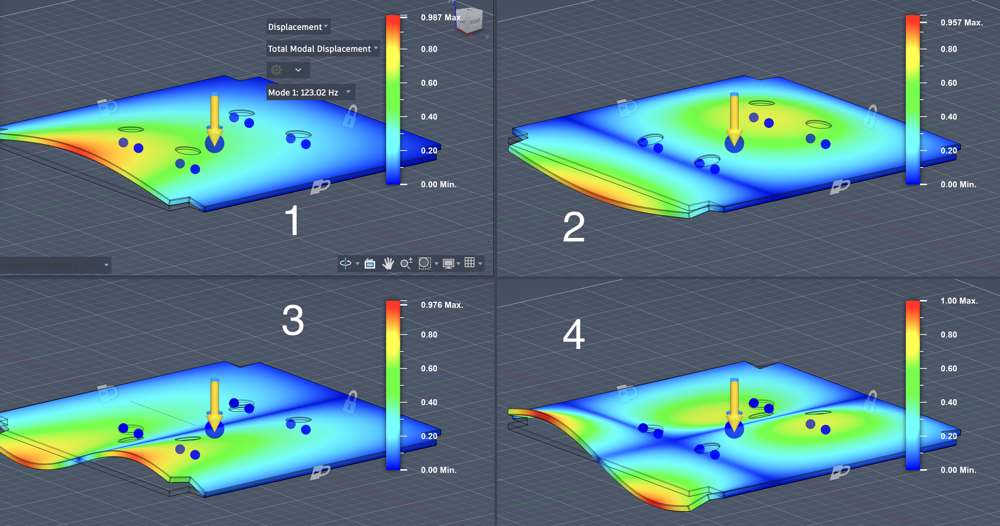
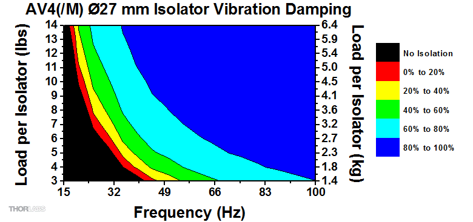
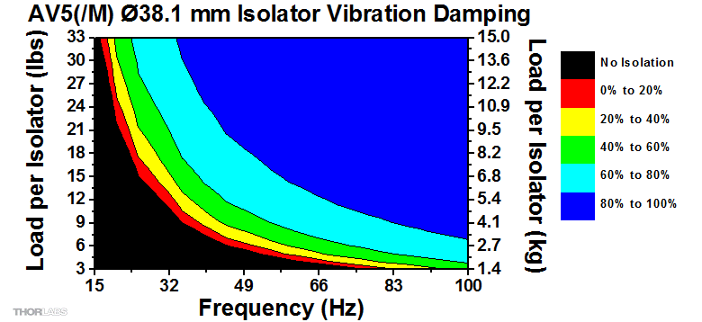

## Design a baseplate to hold neXt in the cart.
This is a log of the testing, iterations and choices made in the design process of the baseplate.

### Requirements
The baseplate needs to:
* Fit into the cart made from item-profiles
* Hold the VECSEL and its coldplate assembly in place
* Serve as sound and vibration isolation for the VECSEL and its coldplate assembly

### Initial design
Initially, the baseplate was designed as a square plate with cutouts on the corners to allow it to fit into the cart made from item-profiles.

<!--  -->

To ensure that the baseplate would fit into the cart, the dimensions of the cart were measured and the baseplate was designed to have a 5mm clearance on all sides. \
A material thickness of 10mm was chosen for the baseplate to provide a level of sound and vibration isolation on its own.
At this point I knew that the VECSEl and its coldplate would be mounted on the baseplate via vibration isolation feet (Thorlabs AV4/M or AV5/M). But the specifics of how the coldplate would look or how the feet would be attached to it were not clear yet.

### VECSEL and coldplate assembly design
After talking to Santiago about the coldplate design, we came to the conclusion that the same screws that would attach the coldplate to the VECSEL, would also mount the feet.
This meant that I now am able to create a more detailed design of the VECSEL and coldplate assembly.

<!--  -->

Now that the design of this assembly was more clear, there was the question of how to keep this assembly in place on the baseplate.\
Here are some of the options that were considered:
* Double-sided tape
* Recesses in the baseplate for the feet to fit into
* Screws to attach the feet to the baseplate

Double-sided tape was ruled out quickly, as it would not allow for easy removal of the assembly and leave residue on the baseplate. \
Screws were also ruled out as the feet on hand do not have holes on the bottom for screws to mount. Furthermore, adding holes to the baseplate would create a direct passage for sound and vibrations to get to the VECSEL. \
This left the option of recesses in the baseplate which would be a good solution, as it would not require any modifications to the feet and allow easy removal of the assembly.

### 'Recess' design
The current design of the baseplate includes recesses for the feet to fit into, which will help to keep the VECSEL and coldplate assembly in place while also providing sound and vibration isolation.

<!--  -->

Here I decided on 1mm clearance around the feet since there was no information if the vibration isolation feet would work well under transverse forces. This way, there will moslty be linear forces along the feet. \
During our team-meeting Tobias reminded me of the resemblance of the baseplate to a drum, and that I should reconsider the placement of the VECSEL right in the center of it.

### Testing
To test this theory, I took the current design and simulated modal frequencies of the baseplate using Autodesk Fusion's simulation tools. This generates a model of a select number of modes using finite element analysis ([FEA](./sub/FEA.md)). \
I also took some data for predominant frequencies from an audio recording in the Lab. ([Notes](sub/Sound_in_Lab.md))

<!--  -->

This measurement was taken because I wanted to think about what sound isolation to order, but it proved to be useful in this work as well.\
The most interesting frequencies in these measurements are around 100 - 115 Hz, because they are the most dominant ones, and they are the hardest ones to isolate from.\
The Thorlabs vibration isolation feet should be able to deal with frequencies above 300 Hz ([discussion](#discussion)), so I will not worry about those for now.

#### 1. Modal frequency analysis
Using the CAD model in fusion (I used fusions Aluminum preset), I constructed a study in which 2 of the sides were held in place, which would be a good estimation for the case where the baseplate is set onto the two braces in the cart.

<!--  -->

##### Simulation setup
- Software: Autodesk Fusion
- Material: Aluminum (Fusion's preset)
- Boundary conditions: 2 opposing side supports fixed
- Number of modes: 8 (4 shown)

<!--  -->

*(Fusion exaggerates displacement for visualization here I synchronized their scales)*

1. Mode 1 (**107 Hz**): Here the maximum relative displacement (MRD) is the smallest (scale in figure), but there is no direct relation given to actual amplitude of the oscillation. The attachment points of the VECSEL move up and down together.
2. Mode 2 (**143 Hz**): Here the current design and layout would lead to a rocking motion of the VECSEL.
3. Mode 3 (**292 Hz**): This mode would lead to the greatest MRD. The attachment points are near a node and see only small displacement. Moving the VECSEL towards the edge would move it into a region of larger displacement.
4. Mode 4 (**306 Hz**): At this frequency there would once again exist a rocking motion but in a different direction than Mode 2.

If we take our frequency spectrum into account the dominant modes would probably be mode 1 and 2.

#### 2. Modal frequency analysis
In this study I decided to try and add another brace to see how the baseplate would oscillate in that case. You can see in there is another lock on the far side of the baseplate in the screenshot, which indicates a constraint.\
**Note, that since this is a new study, I'm not sure if the displacement is comparable to the previous one.**

##### Simulation setup
- Software: Autodesk Fusion
- Material: Aluminum (Fusion's preset)
- Boundary conditions: 3 side supports fixed
- Number of modes: 8 (4 shown)

<!--  -->

1. Mode 1 (**123 Hz**)
2. Mode 2 (**241 Hz**)
3. Mode 3 (**333 Hz**)
4. Mode 4 (**495 Hz**)

Here it seems that we keep some modes, and maybe skip some from before.
Modes 1, 2 and 3 look like you would expect them to look, since I closed one of the sides. But here mode 4 looks similar to mode 5 from the first study (not displayed).\

### Discussion
It seems the drum problem could actually affect the VECSEL since some of the frequencies in the Lab are close to some of the modal frequencies of the baseplate. \
But I don't believe frequencies above 300 Hz will be a big problem since the vibration isolation feet are very good at absorbing those frequencies.

<!--  -->

<!--  -->

(I expect the load per isolator to be between 1.5 - 4kg)

Also placing the VECSEL off center could be disadvantageous since in the current design it often sits close to the nodes.

Ulrich also had the idea of designing a grid of recesses in the baseplate to test different positions. If I don't find a grid solution, I might also decide on 3-4 positions of the VECSEL to add recesses.\
This will be my next job.

### Results
**Modal analysis shows no single perfect position for the VECSEL on the baseplate - adding a third brace appears to shift the resonance away from dominant Lab-noise frequencies.**

The first modes of the baseplate with 2 braces might be close to some Lab-noise, but I can't see an obvious position of the VECSEL on the baseplate, in which this problem is improved.
If problems come up in this regard, adding a brace might be a way to shift the frequencies to a different range, so that the feet can deal with them.

links:
- [FEA](./sub/FEA.md)
- [Sound in Lab](./sub/Sound_in_Lab.md)
- [Further design choices]()