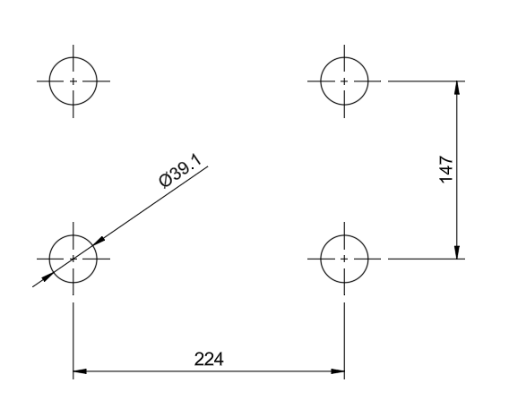

### Further design choices
*In this section I will discuss some new design choices that I have made after the first analysis.*

#### Grid of recessed holes
I tried to design a grid of recessed holes in the baseplate, which would allow me to try out different positions of the VECSEL on the baseplate.\
However, for the diameter chosen for the holes (39.1 mm), I found no configuration of holes that would allow me freely place the VECSEL.

**Measurements**:
- Diameter of the holes: **39.1 mm**
- Long distance between feet:  **224 mm** $= 32 \cdot 7$ mm
- Short distance between feet: **147 mm** $= 21 \cdot 7$ mm

With the common divisor of 7 mm, I found the smallest grid spacing greater than the hole diameter to be 42 mm.\
However, with this spacing the holes will not fit either of the sides. Going below the hole diameter would also introduce gaps in the holes, which could weaken the structure.\
Using slotted holes might be a solution, but at this point I might remove so much material, that the baseplate would start to transmit more vibrations.

This is why I decided against it.

#### Additional mounting positions
Instead of a grid of holes, I decided on 2 more positions for mounting the VECSEL.\
This gives me the option to try out different positions and see if it effects the performance of the VECSEL.

Here I decided to add 2 more positions closer to the fixed edges, since the modal analysis showed smaller relative displacements there.\
I wanted to try out positions with the long and short side closer to the edge, maybe there would be a difference in performance.

This way I can test out different positions without compromising the structure of the baseplate too much.