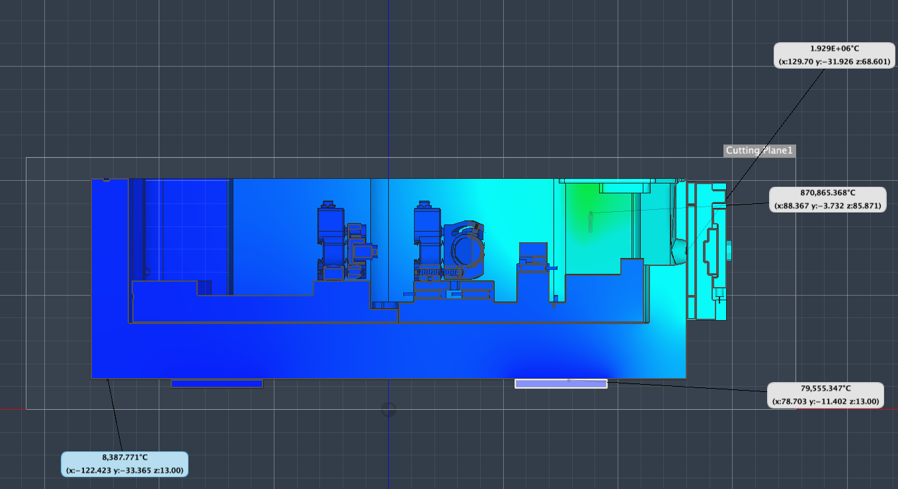

## Temperature gradient in the VECSEL
In this section, we will discuss the temperature gradient in the VECSEL casing and try to estimate a gradient.

### Methods
To estimate a temperature gradient, I tried to create a simple thermal study of the *reduced* VECSEL casing using Autodesk Fusion's Simulation tools.\
This builds on [FEA](../../Baseplate/sub/FEA.md) and I will try to explain the assumptions made.

### First Study
In the first study, I assumed that at a maximum pump power of 40W all the power is converted to heat at some point.\
*This assumption might be wrong.*\
I started with a simplified model of the VECSEL (casing, GC, frequency selective components, TEC's). I then guessed that from the 40W, only 10W would be absorbed by the GC and converted to heat.\
The other 30W would be absorbed by the beam-dump behind the GC and converted to heat there.\
I also applied a constant temperature of 25°C to the TEC's, which would be an accurate assumption if the temperature sensors are mounted directly on the TEC's.\
There was no convection or radiation in this model, only conduction.

Here, we can see that the maxmimum temperature is at around 1.9e6 °C at the GC, which is clearly unrealistic.\
The beam-dump is at around 870 °C, which is also unrealistic.

It seems there are several things that went wrong with this study.
* The assumption that an influx of 10W of optical power by the GC and this being converted to 10W heat must be wrong, since the power has to be converted to optical power to facilitate lasing.
* The rough guessing of power split between the GC and beam-dump is probably wrong.
* The most important thing might be, that the GC has good thermal conductivity to its heatspreader and should be modeled as one part.

### Second Study
To be continued...