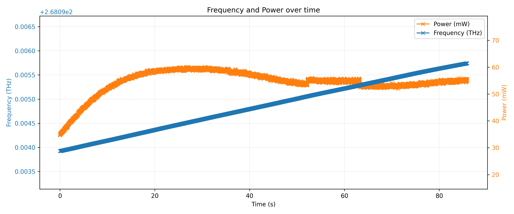
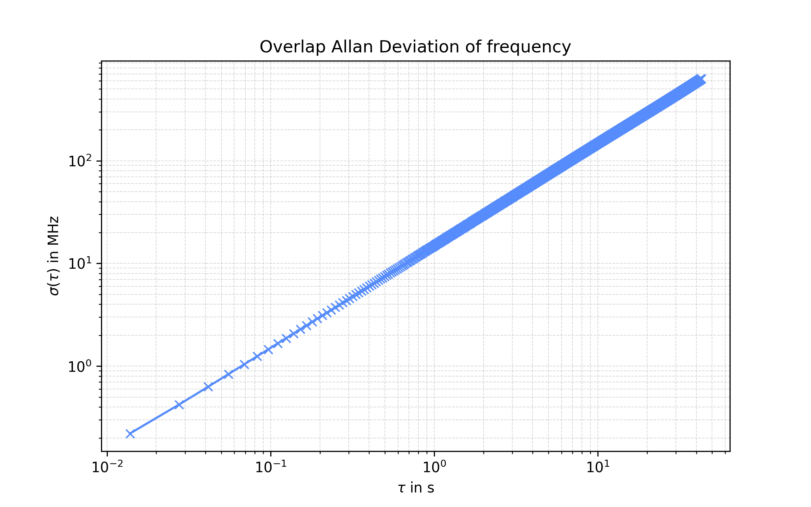
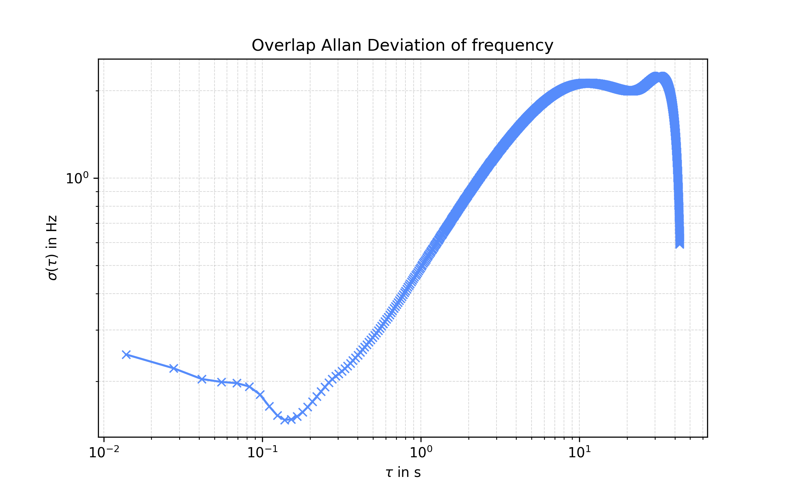
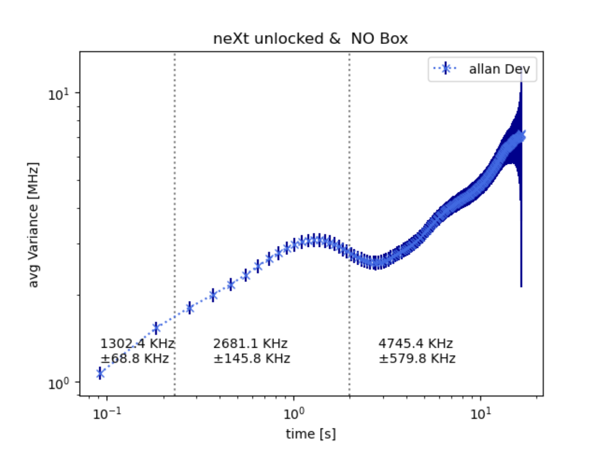

## Reappraisal of Wavemeter Measurements
After reviewing the wavemeter measurements and identifying some difficulties, I tried to reappraise the data.

### Methods
This time I only used part of the wavemeter measurement.\
Before, I used the whole measurement (seen below), but the mode jumps seen in the data below, made the resulting allan deviation plot unreliable.\
During these mode jumps, the frequency difference is much greater, this leads to a higher deviation in the data.\
But this is not what we are looking for.

We are looking for the frequency stability while it is lasing in one mode.\
Here, deviations are a sign of instability that is not caused by thermal drifts for example.

In this time series, I selected the constant ramp you can see from about 350-450 seconds.\
This range was selected, because I identified it visually as the longest stable region without mode jumps.\
The resulting time series looks like this:

Here there seems to be a small jump in power, which might be a result of me having to change exposure time of the wavemeter.\
This is not a problem, because the frequency is still stable.

Using this reduced time series, I calculated the allan deviation again.\
The result looks like this:

For the frequency we can see an allan deviation of around 0.2-1.6 MHz for timescales of 20-100 ms.\
This result is much better than the previous one, which was around 30-50 MHz for the same timescales.\
This time, the allan deviation of the frequency looks much more in line with what we would expect when comparing with Tobi's results.

